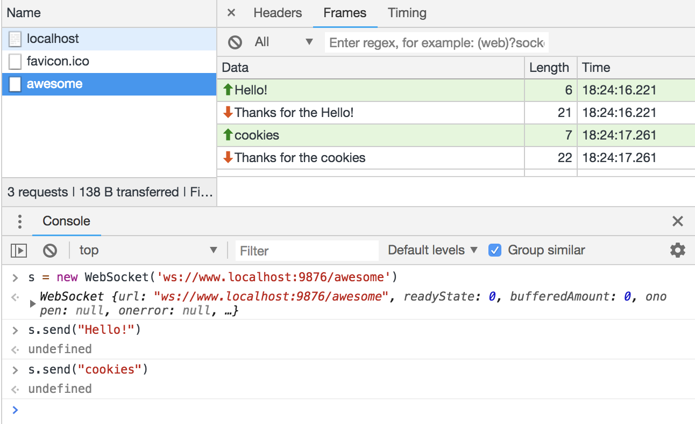

# Reason Websocket
A fork of Based on https://github.com/vbmithr/ocaml-websocket

A library for native websocket server development.

Here's what it looks like to run a websocket server:

```re
Server.run(
  ~port=9876,
  ~onMessage=(text, reply) => {
    reply("Thanks for the " ++ text)
  },
  ~httpFallback=(method, path, headers, msg, respond) => {
    respond(
          "HTTP/1.1 200 OK\r\nContent-Length: 5\r\nContent-Type: text/plain\r\n\r\nHello",
    )
  },
  ~config=(module Server.UnixConfig: Server.Config)
)
```

```
# in this directory
npm install
npm run build
./lib/bs/native/serverexample.native
```

Then open `http://localhost:9876`



